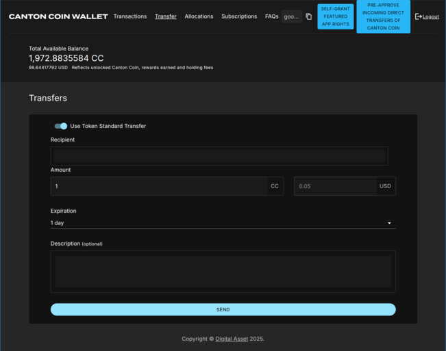

.. _deposits-into-exchanges:

Sending Deposits to Exchanges
===============================

To enable deposits to be sent to specific user accounts at exchanges, an account identifier
needs to be sent to the exchange along with the transfer information. In Canton, the `“memo tag”
pattern <https://support.ledger.com/article/4409603715217-zd>`__ is implemented as follows.

Canton Coin Wallet
------------------
In the Canton Coin wallet, the “Description” field in the screenshot below must be used to
communicate this account identifier in the format required by the exchange. For example:
“AcmeExchange account: <exchangeInternalAccountId>”.

CN Token Standard Wallets
-------------------------
The token standard defines the ``splice.lfdedentralizedtrust.org/reason`` metadata
key for the purpose of communicating a human-readable description for the transfer (see
`CIP-0056 <https://github.com/global-synchronizer-foundation/cips/blob/main/cip-0056/cip-0056.md#generic-metadata>`__).

Token standard wallets must provide a “Description” or “Reason” field analogous to the Canton
Coin wallet, and store its value in the metadata field of the ``Transfer`` specification
(`code <https://github.com/hyperledger-labs/splice/blob/332e06a7ae9e13fde5bba0bf7dcb059aa36f979e/token-standard/splice-api-token-transfer-instruction-v1/daml/Splice/Api/Token/TransferInstructionV1.daml#L12-L43>`__)
when initiating a transfer. This is actually what the Canton Coin wallet does behind the scenes when
initiating a Canton Coin transfer.

Likewise when displaying an incoming transfer or the tx history for a transfer the content of
``splice.lfdedentralizedtrust.org/reason`` metadata key should be parsed and
displayed, as done for example by the transaction history parser in the token standard CLI
(`docs <https://docs.dev.sync.global/app_dev/token_standard/index.html#reading-and-parsing-transaction-history-involving-token-standard-contracts>`__).
This allows exchanges to communicate a correlation-id for a redemption.

Code sample for setting the right metadata field: see this `change to the experimental token
standard CLI <https://github.com/hyperledger-labs/splice/pull/2003/files>`__ to take the
“reason” as command line argument and store it in the metadata field.

CN Token Registries
-------------------

Token standard compliant registries must ensure that they pass the ``Transfer`` specification
unchanged along when implementing multi-step transfers using the ``TransferInstruction``
interface (`code <https://github.com/hyperledger-labs/splice/blob/332e06a7ae9e13fde5bba0bf7dcb059aa36f979e/token-standard/splice-api-token-transfer-instruction-v1/daml/Splice/Api/Token/TransferInstructionV1.daml#L108-L115>`__).
