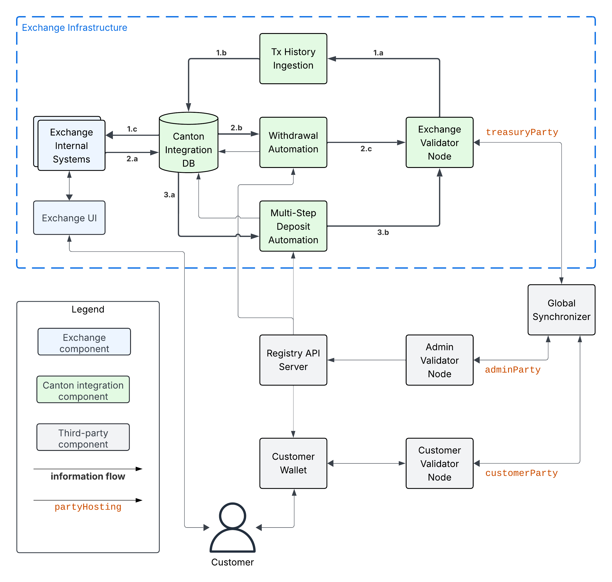

.. _integration-architecture:

Integration Architecture
========================

.. _architecture-high-level-overview:

High-Level Overview
-------------------

.. todo:: merge, link, align this brief summary with the overview in the wallet integration guide

Very likely you have already integrated your exchange with BTC and other UTXO-based chains.
The architecture presented here should align well with your existing architecture; and you
should thus be able to reuse many components and ideas using the following mapping of concepts.

* Transactions are identified in Canton using their globally unique **update-id**.
* Each transaction is committed at specific **record time** that is assigned by the synchronizer
  used to commit the transaction.
* Blockheight in BTC can be mapped to record time on the Global Synchronizer in Canton.
* BTC UTXOs map to what are usually called **active contracts** in Canton.
  Every Canton contract carries data of a specific Daml template type.
  For ease of understanding, we often refer to active contracts as "UTXOs" in this guide.
* BTC addresses map to **parties** in Canton.
* Validator nodes host parties and store their private data. Validator nodes also
  expose the **Ledger API**, which can be used by an owner of a party to
  read their party's state and transactions.
* Canton is designed as a network-of-networks and
  validator nodes can thus be connected to multiple synchronizers.
  Validator nodes merge the data streams from all connected synchronizers into a single logical stream,
  which is why they assign a local **Ledger API offset** to every transaction.
  These offsets are not comparable across validator nodes, but update-ids and record times are.
* Transactions in Canton have a hierarchical structure that reflects the nested execution and visibility of Daml choices.
  Different validator nodes may see different sub-trees of the same transaction depending on which parties they host.
* **Memos** are stored in the transfer metadata using the ``splice.lfdecentralizedtrust.org/reason`` key.
  The Canton Network Token Standard defines this key and a way to parse these memo tags and other transfer information from transactions.

This guide provides a sample architecture and workflows for how you can integrate your exchange with Canton.
The expectation is that the integration components are reasonably thin wrappers
over the functionality provided by the wallet SDK.
The guide expects you to build these components, as they should be mostly concerned
with how to integrate with your exchange's internal systems and requirements.

Component Overview
------------------

The following diagram shows the components for integrating the exchange internal systems
with Canton. We explain the components in the subsections below.

.. https://lucid.app/lucidchart/2a048991-c76c-4a72-8622-66e837f6e1ec/edit?viewport_loc=-1983%2C-124%2C4710%2C2321%2C0_0&invitationId=inv_d2f23474-4e92-4b66-847a-0602e906795e

.. image:: images/component_diagram.png
  :alt: Integration architecture component overview

Exchange Components
^^^^^^^^^^^^^^^^^^^

This guide assumes that there are **Exchange Internal Systems** that manage among other things
the exchange's internal ledger of **Customer** balances.
.. REVIEW: Grammar update: "This guide assumes that there are **Exchange Internal Systems** that manage, among other things, the exchange's internal ledger of **Customer** balances."
These systems are in particular used to serve data to the **Exchange UI**,
which is used by exchange customers to trade, observe their deposits,
and request withdrawals of funds to their wallets.

The guide's assumptions might not be perfectly satisfied by your exchange's actual architecture.
We encourage you to consider them in spirit and map the diagram as best as possible
to your actual architecture.

Canton Integration Components
^^^^^^^^^^^^^^^^^^^^^^^^^^^^^

There are five Canton integration components:

* The **Exchange Validator Node** is a :ref:`Splice validator node <validator_nodes>` that hosts
  the ``treasuryParty`` that controls the funds of the exchange, receives deposits, and
  executes transfers for withdrawals.
  You are not expected to build this node, but you are expected to either operate it yourself
  or use a node-as-a-service provider to operate it for you.
  .. REVIEW: I'd explain what the treasuryParty is here and add a link to how to setup the treasuryParty. If you're reading this guide in order of the links, as I did, this term is sprung on you. - assuming I have it right, it's a party that you're suggesting that they set up to hold the funds of the exchange. That explains that it's not a core Canton concept, but rather something specific to the exchange's implementation.
* The **Canton Integration DB** is used to keep track of the state of withdrawals and
  the customer-attribution of the funds held by the ``treasuryParty``.
  It is shown as a separate component in the diagram, but it could well be part of your
  existing databases. The best choice how to build this component depends on your existing
  architecture.
* The **Tx History Ingestion** service uses the JSON Ledger API exposed by the
  Exchange Validator Node to read Daml transactions affecting the ``treasuryParty``.
  It parses these transactions and updates the Canton Integration DB
  with the effect of these transactions (e.g. a successful deposit to a customer account).
* The **Withdrawal Automation** service is responsible for executing withdrawals
  requested by the Exchange Internal Systems via the Canton Integration DB.
* The **Multi-Step Deposit Automation** service is responsible for accepting or rejecting
  transfers from customers to their exchange accounts for CN tokens that do not
  support direct transfers. It is not necessary for an integration with Canton Coin,
  which does support direct, 1-step transfers.

So concretely, you are expected to build the three services listed above and provide them
with some DB where they can store their state in a way that makes it accessible for querying by the Exchange Internal Systems.
As explained in the :ref:`architecture-high-level-overview`, you should be able to
build these services as thin wrappers over the functionality provided by the wallet SDK
and reuse the DB schemas from your existing UTXO-based integrations.
We explain the expected functionality of the services and the state they store in the Canton Integration DB
in the :ref:`integration-workflows` section.

Third-Party Components
^^^^^^^^^^^^^^^^^^^^^^

The third-party components shown in the diagram are used as follows
in the context of the Canton integration:

* The **Global Synchronizer** serves the validator nodes to commit Daml transactions
  in a decentralized and fault-tolerant manner.
* The **Customer Validator Node** is the validator node that hosts the ``customerParty``
  which is used by the Customer to hold and transfer their funds.
* The **Customer Wallet** is the wallet used by the customer to manage their funds and make
  transactions.
* The **Admin Validator Node** is the validator node used by the token administrator
  to track the ownership records of the token and validate changes to them.
  We use the ``adminParty`` to refer to the party that represents them on ledger.
  Note that the ``adminParty`` for a decentralized token is hosted on multiple validator nodes.
  For example the ``adminParty`` for Canton Coin is hosted on every SV node.
* The **Registry API Server** provides access to extra context to execute
  token transfers. This context is often only known to the token administrator,
  which is why access is provided to it off-ledger. The
  `OpenAPI specification of the Registry API <https://docs.dev.sync.global/app_dev/token_standard/index.html#api-references>`_
  is part of the Canton Network Token Standard.
  .. REVIEW: the link above goes to a paragraph with a link to the CPI - consider just linking directly to the CIP.

.. _information-flows:

Information Flows
-----------------

The following diagram shows the information flows between the components.
The main information flows of the Canton integration are highlighted using bold arrows.
We explain them below.

.. https://lucid.app/lucidchart/2a048991-c76c-4a72-8622-66e837f6e1ec/edit?viewport_loc=549%2C-1204%2C1947%2C960%2C6kMKYgEBcyuH&invitationId=inv_d2f23474-4e92-4b66-847a-0602e906795e

There are three main information flows:

.. REVIEW: Grammar - missing period at the end of the first sentence.
#. **Tx History Ingestion**: ingests the transactions
   affecting the ``treasuryParty`` from the Exchange Validator Node into the Canton Integration DB
   The transaction data is read using the ``/v2/updates/trees``
   `Ledger API endpoint <https://github.com/digital-asset/canton/blob/92339b6f98faaecbe3adbfb71293ed9cbfb30204/community/ledger/ledger-json-api/src/test/resources/json-api-docs/openapi.yaml#L845>`_
   (Arrow 1.a).
   It is parsed by the Tx History Ingestion service to update the status of
   funds, deposits, and withdrawals in the Canton Integration DB (Arrow 1.b).

   This data is queried by Exchange Internal Systems (Arrow 1.c), for example to serve the Exchange UI.
   For brevity, the diagram shows direct access to the Canton Integration DB by the Exchange Internal Systems.
   However using a micro-services architecture, the Exchange Internal Systems would typically access the Canton Integration DB through a dedicated API layer.
   Choose whatever architecture best fits your exchange's needs.

   .. This data is also used by the Multi-Step Deposit Automation service
      to drive its actions (Arrow 3.a).

#. **Withdrawal Automation**:
   starts with the Exchange Internal Systems writing a withdrawal request to the Canton Integration DB (Arrow 2.a).
   The Withdrawal Automation service reads the request from the DB (Arrow 2.b), and prepares, signs, and executes
   a Canton Network Token standard transfer corresponding to the withdrawal request using the Ledger API (Arrow 2.c).
   Note that the status of transfers becomes visible in the transaction history ingested by the Tx History Ingestion service;
   and is communicated to both the Exchange Internal Systems and the Withdrawal Automation service via the Canton Integration DB.
   Note also that the Withdrawal Automation may write back to the Canton Integration DB to mark a withdrawal as failed.

#. **Multi-Step Deposit Automation**:
   is required to support offer-and-accept style transfers for tokens that do not support direct transfers.
   It relies on the Tx Ingestion Service to ingest transfer offers as part of Arrow 1.c.

   The workflow starts with the Multi-Step Deposit Automation service querying the Canton Integration DB to see whether
   there are pending transfers for deposits from customers (Arrow 3.a).
   The service then checks whether the deposit address specified in the transfer is known.
   If yes, it prepares, signs, and executes an accept transaction using the Ledger API (Arrow 3.b).
   If no, then it takes no action, and lets the transfer offer expire or be withdrawn by the sender.

   Note that the Multi-Step Deposit Automation may write back to the Canton Integration DB to store
   that the transaction to accept the deposit could not be committed even after retrying multiple times.
   .. REVIEW: What's the point of this paragraph? Is it that the write transaction may fail?

The other information flows interact with the main flows as part of a deposit or withdrawal.
We explain them in the :ref:`integration-workflows` section.

.. REVIEW: This page is really good. We need a similar one for the WIG. I don't think that it would take much to adjust this one, using the same diagrams for the wallet providers and explaining their flows.
.. One thing that you don't mention so far is how they setup the treasuryParty. I'm assuming that this should be a local party so that they can automate transfers etc. We should explain that to them.

