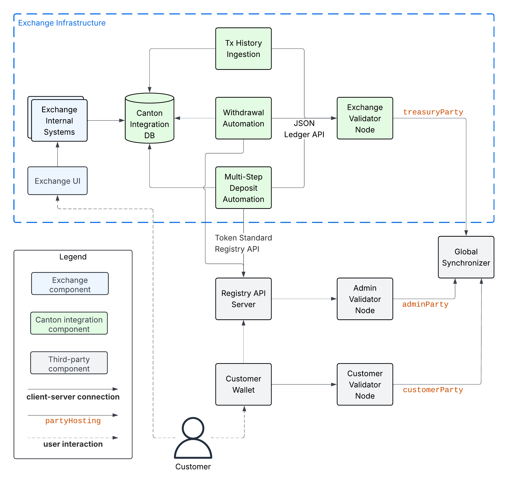

.. _disaster-recovery:

Backup and Restore
==================

Recall that the :ref:`integration-architecture`, shown in the diagram below, relies on two stateful components:
the Exchange Validator Node and the Canton Integration DB.
We recommend backing them up regularly, so that you can restore them in case of a disaster.

Restoring these components from a backup can lead to data loss,
which needs to be handled carefully in the integration components you are building.
See the sections below for guidance on how to do so.

.. _restore-from-validator-node-backup:

Backing up the Exchange Validator Node
---------------------------------------

Follow the `Splice documentation on how to backup a validator node
<https://docs.dev.sync.global/validator_operator/validator_backups.html>`__.

.. TODO: add recommendation to splice docs to take a backup after key rotations, user allocation,
   .dar upload

Backing up the Canton Integration DB
-------------------------------------

As explained in the :ref:`canton-integration-components` section of the :ref:`integration-architecture`,
the Canton Integration DB is more of a logical component.
Whether you implement it as a separate DB or as part of the DBs backing your Exchange Internal Systems
is up to you.

Follow your internal guidance and best practices on what DB system to use and how to back it up.

.. _validator_backup_restore:

Restoring the Exchange Validator Node from a Backup
---------------------------------------------------

Follow the `Splice documentation on how to restore a validator node from a backup
<https://docs.dev.sync.global/validator_operator/validator_disaster_recovery.html#restoring-a-validator-from-backups>`__
to restore the Exchange Validator Node from a backup that is less than 30 days old.

The node will resubscribe to transaction data from the synchronizer and recover
all committed transactions and the corresponding changes to the set of active
contracts (i.e. UTXOs).
However validator-node local data written after the backup will be lost,
as described on the `Canton documentation page <https://docs.digitalasset.com/operate/3.3/howtos/recover/backup-restore.html#restore-caveats>`__.

In the context of the recommended :ref:`integration-workflows`, this data loss
affects:

* **.dar file uploads**: handle this by repeating the upload of all ``.dar`` files that were uploaded after the backup.
  This should be a rare event, as :ref:`token onboarding <token-onboarding>` is infrequent.

* **Ledger API offsets**: offsets assigned to transactions received from the Ledger API may
  change. This only affects the Tx History Ingestion component of the integration.

Runbook
^^^^^^^

Follow these steps to restore the Exchange Validator Node from a backup:

1. Stop Tx History Ingestion before restoring the Exchange Validator Node from a backup.
2. Retrieve the record time ``tRecovery`` and ``synchronizerId`` of the last ingested transaction from the Canton Integration DB.
3. Restore the Exchange Validator Node from the backup.
4. Reupload all ``.dar`` files that were uploaded after the backup.
5. Log into the `Canton Console of your validator node <https://docs.dev.sync.global/deployment/console_access.html>`__
   and query the offset ``offRecovery`` assigned to ``tRecovery`` using

   .. code-block:: scala

     def parseTimestamp(t: String) = {
       val isoFormat = java.time.format.DateTimeFormatter.ISO_INSTANT.withZone(java.time.ZoneId.of("Z"))
       isoFormat.parse(t, java.time.Instant.from(_))
     }
     val synchronizerId = SynchronizerId.tryFromString("example::1220b1431ef217342db44d516bb9befde802be7d8899637d290895fa58880f19accc") // example
     val tRecovery = parseTimestamp("2024-05-01T12:34:56.789Z") // example
     val offRecovery = participant.parties.find_highest_offset_by_timestamp(synchronizerId, tRecovery)

   Alternatively, you can use ``grpcurl`` to query the offset ``offRecovery`` from the command line as shown in the
   example below:

   .. code-block:: bash

      grpcurl -plaintext -d \
        '{"synchronizerId" : "example::1220be58c29e65de40bf273be1dc2b266d43a9a002ea5b18955aeef7aac881bb471a",
          "timestamp": "2025-11-27T06:50:00.000Z"}' \
        localhost:5002 \
        com.digitalasset.canton.admin.participant.v30.PartyManagementService.GetHighestOffsetByTimestamp

   If you use authentication for the Canton Admin gRPC API, then you need to add the appropriate
   authentication flags to the ``grpcurl`` command above.

6. Configure the Tx History Ingestion component to start ingesting from offset ``offRecovery``.
7. Restart the Tx History Ingestion component.

Once Tx History Ingestion has caught up, the integration workflows will continue
as before the disaster.

.. note::

  These steps assume that record times assigned to transactions are unique,
  which is the case unless you are using participant-local operations that modify the
  transaction history. These are ACS imports, party migrations, party replication,
  or `repair commands <https://docs.digitalasset.com/operate/3.4/explanations/repairing.html>`__.
  Multi-hosting a party from the start does not lead to non-unique record times.

  If your are using participant-local operations that modify the transaction history,
  then you we recommend adjusting Step 5 as follows to deal with the rare case of
  a partial ingestion of transactions with the same record time:

    1. Lookup the recovery offset ``offRecovery`` as of ``tRecovery - 1 microsecond``.
    2. Start ingesting from offset ``offRecovery``, but filter out all transactions
       whose update-id is already known in the Canton Integration DB because they
       have been ingested before Tx History Ingestion was stopped in Step 1.

.. _restore-canton-integration-db:

Restoring the Canton Integration DB from a Backup
-------------------------------------------------

Follow your internal guidance and best practices on how to restore the Canton Integration DB from a backup.

From a data consistency perspective, all writes to the Canton Integration DB by
Tx History Ingestion will be recovered without data loss from the transactions
stored on the Exchange Validator Node.

Likewise, the write in Step 3 of the :ref:`one-step-withdrawal-workflow`
to mark a withdrawal as failed due to the lack of a CC transfer-preapproval
is safe to redo, as it is idempotent.

Thus the only data loss that you need to handle
is the loss of data written by your Exchange Internal Systems to the Canton Integration DB
to request the execution of a withdrawal.
This data consists in particular of the withdrawal-id, the UTXO reservation state,
and the reservation of user funds for the withdrawal.
See Step 2 in the :ref:`one-step-withdrawal-workflow` and
Step 2 in the :ref:`multi-step-withdrawal-workflow` for details.

The problem to avoid is for the user to initiate another withdrawal of the funds
whose withdrawal might be in-flight on Canton.
You can do so as follows:

1. Disable initiating withdrawals of CN tokens in your Exchange Internal Systems
   and stop the Withdrawal Automation component.
2. Restore the Canton Integration DB from the backup.
3. Wait until Tx History Ingestion has ingested a record time ``tSafe`` that is
   larger than the largest target record time ``trecTgt`` of all in-flight withdrawals.
   Assuming you use a constant ``ttl`` to compute the ``trecTgt`` of a withdrawal,
   you can estimate ``tSafe`` as ``now + ttl``.
4. Enable withdrawal creation in your Exchange Internal Systems
   and start the Withdrawal Automation component.
   The integration is operational again.

Step 3 takes care to resynchronize the state of the Canton Integration DB
with the state of in-flight withdrawals on Canton.
For this to work it is important that you implement Tx History Ingestion
such that it can handle ingesting withdrawal transfers whose withdrawal-id
cannot be resolved because the corresponding withdrawal request was lost in the restore.

We recommend doing so by having the Tx History Ingestion re-create
the withdrawal request record from the on-chain data.
Likely not all fields can be recovered, so consider either
marking the withdrawal as "recovered" and leaving them blank.
Alternatively, you can store these fields in additional metadata on the transfer record
when creating the withdrawal transfer on-chain.
This will though cost additional traffic and may leak information to your customer
and the token admin.
