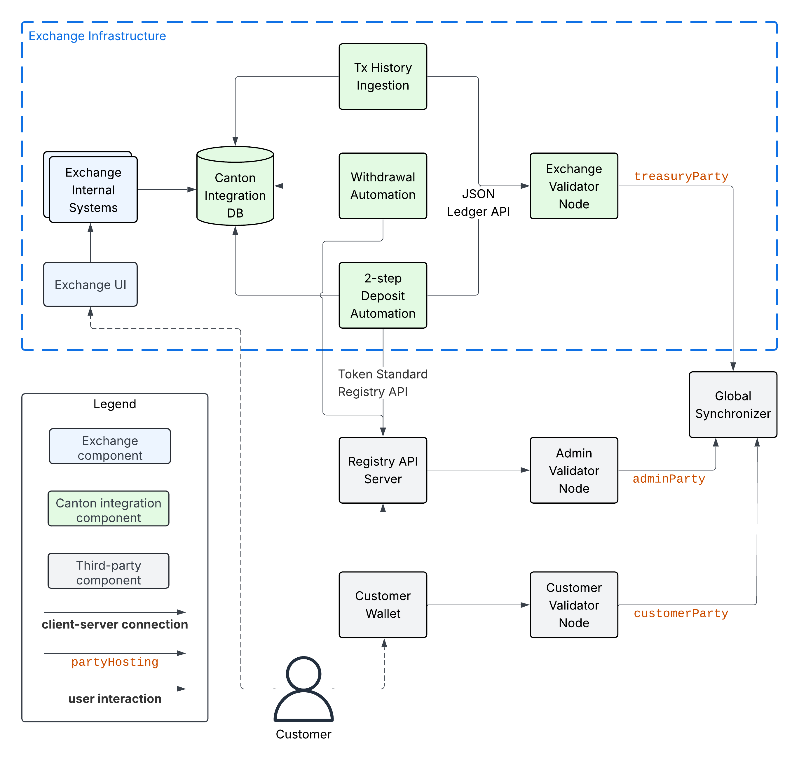

Fault Tolerance
===============

.. TODO: I'd add the architecture diagram at the top of this page - you refrence components from it so it would be good to use as a reference.

Recall the architecture diagram from the :ref:`integration-architecture` section:

Below you learn how to handle crashes of the integration components,
how to handle RPC errors, and
how to perform disaster recovery for the Exchange Validator Node.

Handling Crashes
^^^^^^^^^^^^^^^^

Validator nodes are crash-fault tolerant and do not lose data shared on the Ledger API
in case of a crash.
Thus a restart is sufficient to recover from crashes.
Likewise, we assume that the Canton Integration DB is backed
by a crash-fault tolerant database (e.g., PostgreSQL or MySQL).

For the integration components that you build, we recommend the following strategy to handle crashes and restarts:

* **Tx History Ingestion**: keep track of the last ingested offset in the Canton Integration DB.
  On restart, continue from that offset.
  If none is set, then that means it never ingested any transaction.
  In that case, start from the beginning of the transaction history, i.e., start from offset ``0``.

  For this to work, it is important that you store the ingested offset
  in the same transaction as you store the ingested data. See
  the individual :ref:`integration-workflows` descriptions for details.

* **Withdrawal Automation**: make it stateless, so that it can just restart.
  This is in line with how we recommend to implement both
  the :ref:`one-step-withdrawal-workflow` and
  the :ref:`multi-step-withdrawal-workflow`.

* **Multi-Step Deposit Automation**: make it stateless, so that it can just restart.
  This is in line with how we recommend to implement the :ref:`multi-step-deposit-workflow`.

.. _retrying-rpc-errors:

Handling RPC Errors
^^^^^^^^^^^^^^^^^^^

Below we explain our recommendation for handling RPC errors in the integration components you are building.
We focus on handling errors from interacting with the Ledger API and the
Registry API Servers of the token admins.
We do not cover handling errors from accessing DBs or other internal systems,
as we assume you have strategies in place for those.

* **Tx History Ingestion**: only reads from the Ledger API. We recommend to
  retry these reads a bounded number of times on :ref:`retryable-errors`. Wait at least a few seconds
  between retries and consider using `exponential backoff <https://docs.aws.amazon.com/prescriptive-guidance/latest/cloud-design-patterns/retry-backoff.html>`__
  to avoid overloading the Validator Node.
  Consider crashing the ingestion component if the bounded number of retries is exceeded
  to recover from bugs in the in-memory state of the ingestion component.

.. _withdrawal-automation:

* **Withdrawal Automation**:
  recall from :ref:`one-step-withdrawal-workflow` that the Withdrawal Automation
  first retrieves extra context from the Registry API Server of the token admin
  and then prepares, signs, and executes the transaction to submit the transfer for the withdrawal using
  the ``/v2/interactive-submission/executeAndWait`` endpoint of the Ledger API.

  We recommend that you retry the steps from the start when encountering a :ref:`retryable error <retryable-errors>`.
  You thereby ensure that you prepare the withdrawal transaction
  using the latest state of the Validator Node and the latest extra context from the Registry API Server.
  Use a bounded number of retries with at least a few seconds between retries
  and consider using exponential backoff.

  Retrying all steps is safe from a consistency perspective
  because the withdrawal transaction is idempotent,
  as it archives the UTXOs used to fund the transfer once the transfer is submitted.
  You nevertheless want to avoid retrying too often,
  as executing a transaction costs traffic.

  Stop retrying once the withdrawal has been marked as definitely failed
  in the Canton Integration DB by the Tx History Ingestion component.
  A withdrawal is considered definitely failed once its target record time ``trecTgt`` is below
  the last ingested record time.

* **Multi-Step Deposit Automation**: the approach is analogous to the one for Withdrawal Automation.

  Recall from :ref:`multi-step-deposit-workflow` that the Multi-Step Deposit Automation
  discovers a pending deposit by reading from the Canton Integration DB,
  then retrieves extra context from the Registry API Server of the token admin
  and finally prepares, signs, and executes the transaction to accept the transfer offer using
  the ``/v2/interactive-submission/executeAndWait`` endpoint of the Ledger API.

  We recommend that you retry the steps from the start when encountering a :ref:`retryable error <retryable-errors>`.
  You thereby ensure that you prepare the transaction to accept the transfer offer
  using the latest state of the Validator Node and the latest extra context from the Registry API Server.
  Use a bounded number of retries with at least a few seconds between retries
  and consider using exponential backoff.

  Retrying all steps is safe from a consistency perspective
  because the accept transaction is idempotent,
  as it archives the transfer offer once it is accepted.
  You nevertheless want to avoid retrying too often,
  as executing a transaction costs traffic.

  You can stop retrying after a bounded number of retries.
  The sender can reclaim their funds at any point by withdrawing the offer.
  The Multi-Step Deposit Automation will learn about the withdrawal of the offer
  via the Tx History Ingestion component, which will mark the transfer offer as
  withdrawn in the Canton Integration DB.

.. _retryable-errors:

Retryable errors
~~~~~~~~~~~~~~~~~~~~~

For increased robustness and fault tolerance, we recommend to retry by default on all errors and
manage an exclude list of non-retryable errors. As a starting opint, we suggest to exclude
the following HTTP error codes from retries:

* 401 Unauthorized
* 403 Forbidden
* 500 Internal Server Error
* 501 Not Implemented

.. _reading-from-canton-coin-scan:

Reading from Canton Coin Scan
~~~~~~~~~~~~~~~~~~~~~~~~~~~~~

As explained in :ref:`mvp-for-cc`, the Registry API Server of the token admin for
Canton Coin is provided by the Canton Coin
`Scan services <https://docs.dev.sync.global/app_dev/scan_api/toc_proxy.html>`__.
They are run as part of every SV node.

For convenience, every Validator Node provides
a `Scan proxy service <https://docs.dev.sync.global/app_dev/validator_api/index.html#scan-proxy-api>`__
to read from the Scan instances run by SVs with Byzantine fault tolerance.
The Scan proxy service also implements the Token Standard Registry API for Canton Coin.

We recommend to use Scan proxy service of the Exchange Validator Node
to retrieve the extra context for Canton Coin transfers.

If that is not possible, then you can read from a random Canton Coin Scan instance
for the purpose of retrieving extra context for Canton Coin transfers.
The on-ledger validation of the transfers ensures that
you do not need to trust the Scan instance for correctness.
Ensure that you read from a different Scan instance on every retry
to avoid being affected by a faulty Scan instance for too long.
