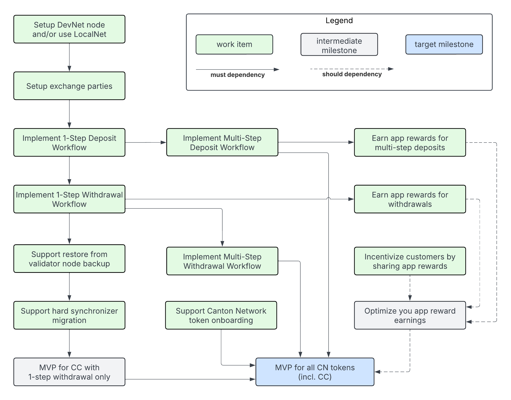

.. _exchange-integration-overview:

Overview
========

This guide aims to help you integrate your exchange with Canton
for the purpose of trading Canton Coin (CC) and Canton Network (CN) tokens.

What is the status of this guide?
---------------------------------

The guide is under active development and not all sections are complete.
Here are some things you can do with it in its current state:

* Understand the :ref:`recommended architecture <integration-architecture>` and compare it to your existing
  integration architectures for UTXO-based chains.
* Understand how deposits and withdrawals work by reading the :ref:`integration-workflows` section.
* Get a feel for the overall integration project
  by browsing the :ref:`table of contents <exchange-integration>`
  and the sketches of the incomplete sections.

What to develop in what order?
------------------------------

The guide aims to provide comprehensive guidance for integrating
with Canton. Depending on your experience with UTXO-based chains and
Canton's smart contract and privacy model, using the guide may seem overwhelming at first.

The guide is intentionally structured such that you can use a learning-by-doing approach
and deliver your integration in a series of incremental milestones.
The following dependency diagrams shows the work items and milestones, which we explain below.

* **MVP for CC**: this MVP allows you to support deposits and withdrawals of Canton Coin (CC).
  It includes earning app rewards for all CC deposits.
  It comes with the limitation that users must setup a CC transfer preapproval to receive withdrawals.
  See the following sections for details on the work items it depends on.

  * :ref:`Setup DevNet node and/or use LocalNet <test-node-setup>`
  * :ref:`exchange-parties-setup`
  * :ref:`one-step-deposit-workflow`
  * :ref:`one-step-withdrawal-workflow`
  * :ref:`Support restore from validator node backup <restore-from-validator-node-backup>`
  * :ref:`Support hard synchronizer migration <hard-synchronizer-migration>`

* **MVP for all CN Tokens**: this MVP allows you to support deposits and withdrawals of all CN tokens.
  It comes with the limitation that app rewards are only earned on deposits of CC, but not on deposits of other CN tokens.
  It depends on the MVP for CC and the following additional work items:

  * :ref:`multi-step-deposit-workflow`
  * :ref:`multi-step-withdrawal-workflow`, which resolves the limitation that users must setup a CC transfer preapproval to receive withdrawals.
  * :ref:`token-onboarding`

* **Earn app rewards for all CN tokens**: is an additional milestone that improves
  the profitability of your integration by implementing the changes required so that
  your exchange earns app rewards on both withdrawals and deposits of all CN tokens.

  * :ref:`deposit-app-rewards`
  * :ref:`withdrawal-app-rewards`
