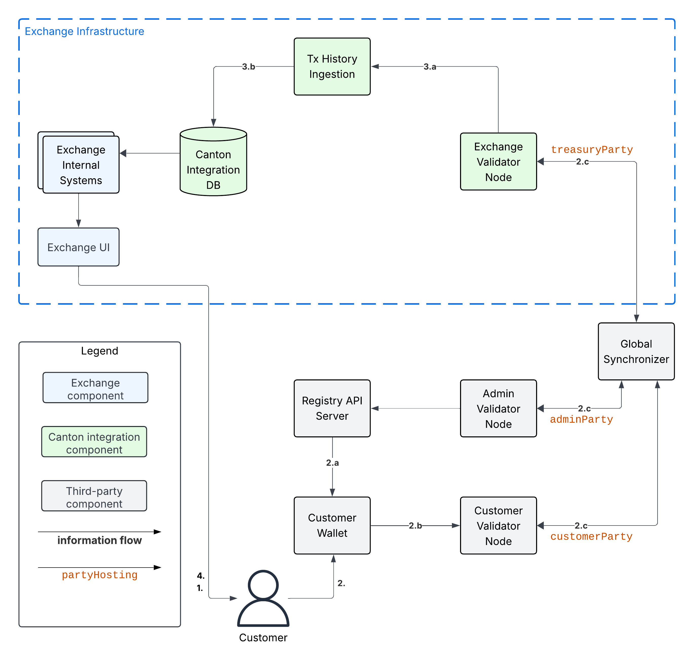
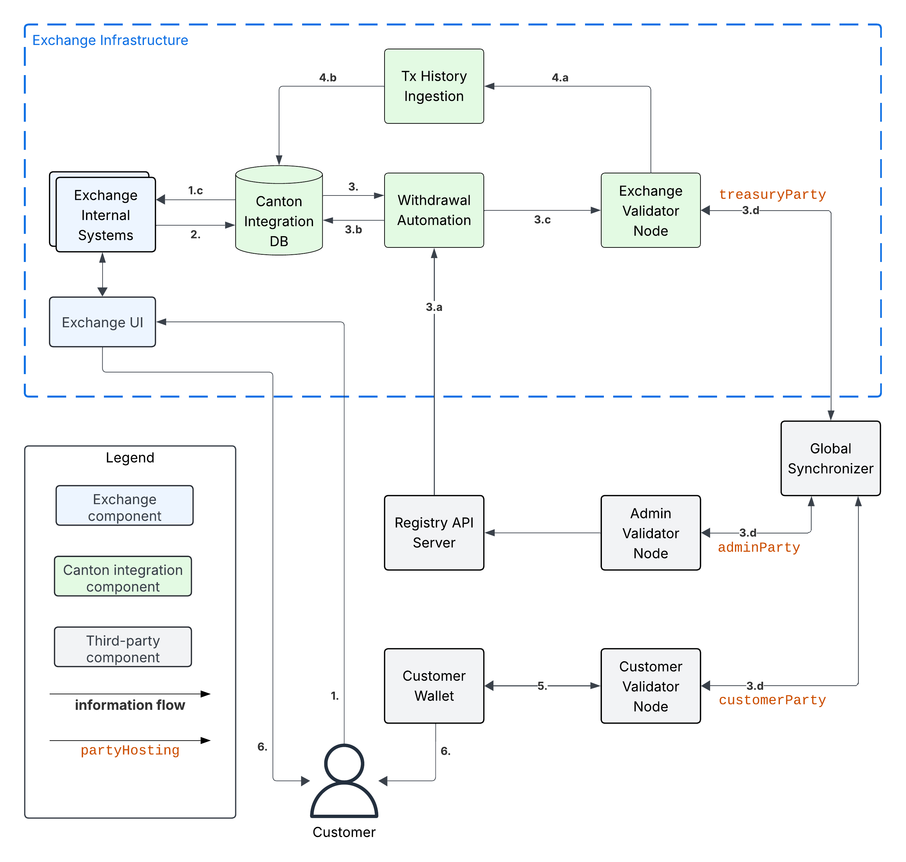

.. _integration-workflows:

Integration Workflows
=====================

Overview
--------

The workflows below are grouped into two integration stages.

* :ref:`mvp-for-cc` contains the minimum viable product (MVP) workflows for integrating Canton Coin (CC) into the exchange.
  It comes with the limitation that both the exchange and the customers need to set up a ``TransferPreapproval`` to
  enable 1-step transfers of CC.
* :ref:`mvp-for-cn-tokens` contains the additional workflows required to support
  all CN tokens. They are the workflows to onboard a new token and
  the workflows to support multi-step transfers for both deposits and withdrawals.
  Multi-step transfers are a part of the Canton Network Token Standard to support
  tokens where the receiver is given a choice to reject an incoming transfer as well as
  to support additional asynchronous checks on transfers by the token admin (e.g. KYC/AML checks).

Further extensions of these two MVPs to address Day-2 requirements are discussed in :ref:`integration-extensions`.

.. important::

  The current descriptions of the workflows do not yet call out the wallet SDK
  functions implementing their individual steps; and may thus appear overly detailed and complex.
  They are meant to give a first overview until the references to the specific SDK functions have been added.

  .. todo:: add these functions. potentially using sphinx-tabs to allow switching between SDK function view and higher-level description

.. _mvp-for-cc:

MVP for Canton Coin
-------------------

.. note::

   The diagrams in the sections below specialize the diagram from the :ref:`information-flows`
   section to the case for Canton Coin (CC). The specializations are:

   * The role of the ``adminParty`` is taken over by the ``dsoParty``, which is the token admin for CC.
     The ``dsoParty`` is a decentralized party that is hosted on the validator
     nodes run by SV operators. A confirmation threshold of 2/3 is used to achieve Byzantine fault-tolerance
     for its transaction validation.
   * The role of the Registry API Server is taken over by the Canton Coin Scan services
     that every SV operator runs. They serve the Registry API for CC.
     See :ref:`reading-from-canton-coin-scan` for more information about
     how to reliably read from multiple Canton Coin Scan instances.

.. _one-step-deposit-workflow:

1-Step Deposit Workflow
^^^^^^^^^^^^^^^^^^^^^^^

Assumptions:

-  Exchange set up a CC ``TransferPreapproval`` for their
   ``treasuryParty`` as explained in :ref:`setup-treasury-party`.
-  Exchange associated deposit account “abc123” with Customer in
   the Canton Integration DB.

Example flow:

1. Customer uses Exchange UI to retrieve ``treasuryParty`` and deposit
   account-id “abc123” to use for the deposit
2. Customer uses Customer Wallet to initiate a token standard transfer of
   100 CC to ``treasuryParty`` with metadata key
   ``splice.lfdecentralizedtrust.org/reason`` set to “abc123”.

   a. Customer Wallet selects CC ``Holding`` UTXOs to fund the transfer
      and queries Canton Coin Scan to retrieve registry-specific
      ``TransferFactory`` and extra transfer context. The returned data
      includes the ``TransferPreapproval`` for the ``treasuryParty``.
   b. Customer wallet submits the command to exercise
      ``TransferFactory_Transfer`` choice together with the extra
      transfer context. The resulting transaction archives the funding
      CC ``Holding`` UTXOs and creates a CC ``Holding`` UTXO with
      contract-id ``coid234`` owned by the ``treasuryParty`` and
      another CC ``Holding`` UTXO for the change owned by the Customer.
   c. The resulting transaction gets committed across the Customer,
      Exchange, and SV validator nodes. It is assigned an
      update-id ``upd567`` and a record time ``t1`` by the Global
      Synchronizer. It is assigned offset ``off1`` by the Exchange
      Validator Node.

3. Tx History Ingestion observes ``upd567`` at ``t1`` with offset
   ``off1`` and updates the Canton Integration DB as follows.

   a. Tx History Ingestion parses ``upd567`` using the token standard tx
      history parser from the Wallet SDK to determine:

      * The deposit amount of 100 CC.
      * The deposit account “abc123” from the
        ``splice.lfdecentralizedtrust.org/reason`` metadata value.
      * The new ``Holding`` UTXO ``coid234`` owned by the
        ``treasuryParty``

   b. Tx History ingestion writes the following in a single, atomic
      transaction to the Canton Integration DB

      * The latest ingested update-id ``upd567`` its record time ``t1``
        and offset ``off1``.
      * The new CC ``Holding`` UTXO ``coid234`` for the 100 CC that was
        received.
      * The credit of 100 CC on the Customer’s account at the exchange.

4. Customer observes the successful deposit in their Exchange UI,
   whose data is retrieved from the Canton Integration DB via the Exchange Internal Systems.

.. _one-step-withdrawal-workflow:

1-Step Withdrawal Workflow
^^^^^^^^^^^^^^^^^^^^^^^^^^

Assumptions:

1. Customer set up a CC ``TransferPreapproval`` for their
   ``customerParty``.

Example flow:

1. Customer requests withdrawal of 100 CC to ``customerParty`` using
   the Exchange UI.
2. Exchange Internal Systems process that request and update the
   Canton Integration DB to store:

   * The deduction of 100 CC from the Customer's trading account.
   * The pending withdrawal with id ``wid123`` of 100 CC to
     ``customerParty``.
   * The CC ``Holding`` UTXOs ``coids`` to use to fund the transfer to
     ``customerParty`` for ``wid123``. See :ref:`utxo-management` for more information.
   * The target record time ``trecTgt`` on the Global Synchronizer
     until which the transaction for the CC transfer must be committed
     using the ``coids`` UTXOs for funding ``wid123``. The ``coids``
     are considered to be reserved to funding this transfer until
     ``trecTgt`` has passed.

3. Withdrawal Automation observes the pending withdrawal ``wid123`` and
   commits the corresponding CC transfer as follows.

   a. Withdrawal Automation queries Canton Coin Scan to retrieve the
      ``TransferFactory`` for CC and extra transfer context.
   b. Withdrawal automation checks that transfer is indeed a 1-step
      transfer by checking that ``transfer_kind`` = ``"direct"`` in the response from
      Canton Coin Scan. If that is not the case, then it marks the withdrawal
      as failed in the Canton Integration DB and stops processing.
   c. Withdrawal Automation prepares, signs, and submits the command to
      exercise the ``TransferFactory_Transfer`` choice with the
      exclusive upper-bound for the record time of the commit set to
      ``trecTgt``. It also sets the value for key
      ``splice.lfdecentralizedtrust.org/reason`` in the ``Transfer`` metadata to ``wid123``.
   d. The resulting transaction archives the CC ``Holding`` UTXOs
      ``coids`` used to fund the transfer and creates one CC ``Holding``
      UTXO with contract-id ``coid345`` owned by the ``customerParty``
      and another one with contract-id ``coid789`` owned by
      ``treasuryParty`` representing the change returned to the
      Exchange. The resulting transaction gets committed across the
      Customer, Exchange, and SV validator nodes. It is assigned
      an update-id ``upd567`` and a record time ``t1`` < ``trecTgt`` by
      the Global Synchronizer. It is assigned ``off1`` by the Exchange
      Validator Node. It is assigned ``off2`` by the Customer Validator
      Node.

4. Tx History Ingestion observes ``upd567`` at ``t1`` with offset
   ``off1`` and updates the Canton Integration DB as follows.

   a. Tx History Ingestion parses ``upd567`` using the token standard tx
      history parser from the Wallet SDK to determine:

      * The withdrawal-id ``wid123`` from the
        ``splice.lfdecentralizedtrust.org/reason`` metadata value.
      * The new ``Holding`` UTXO ``coid789`` owned by the
        ``treasuryParty``

   b. Tx History ingestion writes the following in a single, atomic
      transaction to the Canton Integration DB

      * The latest ingested update-id ``upd567``, its record time
        ``t1`` and offset ``off1``.
      * The successful completion of withdrawal ``wid123`` by the
        transaction with update-id ``upd567`` at record time ``t1``.
      * The archival of the CC ``Holding`` UTXOs ``coids``.
      * The new CC ``Holding`` UTXO ``coid789`` for the change returned
        after funding the CC transfer.

5. Customer Wallet observes ``upd567`` at ``t1`` with offset ``off2`` on
   the Customer Validator Node, parses it using the token standard tx
   history parser and updates its UI as follows:

   * Its tx history shows the receipt of 100 CC from ``exchangeParty``
     with “Reason” ``wid123`` that was committed as update ``upd567``
     at ``t1``.
   * Its holding listing shows the new CC ``Holding`` with contract id
     ``coid345``.

6. Customer observes the completion of the withdrawal at ``t1`` in the
   Exchange UI and the receipt of the expected funds in their Customer Wallet.

.. _utxo-management:

UTXO Selection and Management
^^^^^^^^^^^^^^^^^^^^^^^^^^^^^

.. TODO: write this

.. _mvp-for-cn-tokens:

MVP for all Canton Network Tokens
---------------------------------

The MVP for supporting all Canton Network tokens builds on the MVP for Canton Coin.
The key changes required are:

* Change Tx History Ingestion to also ingest the ``TransferInstruction`` UTXOs, which are
  used by the Canton Network Token Standard to represent in-progress transfers (see
  `docs <https://docs.dev.sync.global/app_dev/token_standard/index.html#transfer-instruction>`_,
  `code <https://github.com/hyperledger-labs/splice/blob/2997dd9e55e5d7901e3f475bc10c3dc6ce95ab0c/token-standard/splice-api-token-transfer-instruction-v1/daml/Splice/Api/Token/TransferInstructionV1.daml#L93-L105>`_).
* Adjust the Exchange UI to show the status of in-progress transfers.
* Adjust the user funds tracking done as part of Tx History Ingestion to credit funds back to the user if they reject a withdrawal transfer.
  Consider deducting a fee for the failed withdrawal.
* Implement the Multi-Step Deposit Automation service to auto-accept incoming transfers that are pending receiver acceptance.
  Ensure that the deposit address is known before accepting the transfer.
* Add support for configuring the URL of a token admin's Registry API Server and to deploy
  their .dar files as described in :ref:`token-onboarding`.

The sections below provide worked examples for the resulting multi-step deposit and withdrawal workflows.
All examples assume that:

1. There is a token admin called **Acme** who issues a token called **AcmeToken**
   on the Canton Network and operates their own Admin Validator Node
   and their own Registry API Server.
2. The Exchange and Customer have onboarded AcmeToken as per :ref:`token-onboarding`.

.. _multi-step-deposit-workflow:

Multi-Step Deposit Workflow
^^^^^^^^^^^^^^^^^^^^^^^^^^^^

.. TODO: add diagram, and flow description

.. _multi-step-withdrawal-workflow:

Multi-Step Withdrawal Workflow
^^^^^^^^^^^^^^^^^^^^^^^^^^^^^^

Example flow: successful offer and acceptance
~~~~~~~~~~~~~~~~~~~~~~~~~~~~~~~~~~~~~~~~~~~~~

The flow shares most of its first step with the :ref:`one-step-withdrawal-workflow`
above. We list the full step below for completeness.

1. Customer requests withdrawal of 100 AcmeToken to ``customerParty`` using
   the Exchange UI.

2. Exchange Internal Systems process that request and update the
   Canton Integration DB to store:

   * The deduction of 100 AcmeToken from the Customer's trading account.
   * The pending withdrawal with id ``wid123`` of 100 AcmeToken to
     ``customerParty``.
   * The AcmeToken ``Holding`` UTXOs ``coids`` to use to fund the transfer to
     ``customerParty`` for ``wid123``. See :ref:`utxo-management` for more information.
   * The target record time ``trecTgt`` on the Global Synchronizer
     until which the transaction for the AcmeToken transfer must be committed
     using the ``coids`` UTXOs for funding ``wid123``. The ``coids``
     are considered to be reserved to funding this transfer until
     ``trecTgt`` has passed.

3.  Withdrawal Automation observes the pending withdrawal ``wid123`` and
    commits the corresponding AcmeToken transfer as follows.

    a. Withdrawal Automation retrieves the URL for Acme's Registry API Server
       from the Canton Integration DB.
    b. Withdrawal Automation queries Acme's Registry API Server to retrieve the
       ``TransferFactory`` for AcmeToken and extra transfer context.
    c. Withdrawal Automation prepares, signs, and submits the command to
       exercise the ``TransferFactory_Transfer`` choice with the
       exclusive upper-bound for the record time of the commit set to
       ``trecTgt``. It also sets the value for key
       ``splice.lfdecentralizedtrust.org/reason`` in the ``Transfer`` metadata to ``wid123``;
       and it sets the upper bound for the customer to accept the transfer far
       enough in the future (e.g. 30 days).
    d. The resulting transaction gets committed across the Customer,
       Exchange, and Acme validator nodes. It is assigned an
       update-id ``upd567`` and a record time ``t1`` < ``trecTgt`` by
       the Global Synchronizer. It is assigned ``off1`` by the Exchange
       Validator Node. It is assigned ``off2`` by the Customer Validator
       Node. The resulting transaction has the following effects:

       * It archives the AcmeToken ``Holding`` UTXOs ``coids`` used to fund
         the transfer.
       * It creates an AcmeToken ``Holding`` UTXO with contract-id ``coid789``
         owned by ``treasuryParty`` representing the change returned
         to the Exchange.
       * It creates one locked AcmeToken ``Holding`` UTXO with amount 100 and
         contract-id ``coid345`` owned by the ``treasuryParty``.
       * It creates a ``TransferInstruction`` UTXO with contract-id
         ``coid567`` representing the transfer offer.
         This ``TransferInstruction`` includes a copy of the ``Transfer``
         specification and its metadata.

4.  Tx History Ingestion observes ``upd567`` at ``t1`` with offset
    ``off1`` and updates the Canton Integration DB as follows.

    a. Tx History Ingestion parses ``upd567`` using the token standard
       tx history parser from the Wallet SDK to determine:

       * The withdrawal-id ``wid123`` from the
         ``splice.lfdecentralizedtrust.org/reason`` metadata value.
       * The new locked AcmeToken ``Holding`` UTXO ``coid345`` owned by the
         ``treasuryParty``.
       * The new  AcmeToken ``Holding`` UTXO ``coid789`` owned by the
         ``treasuryParty``

    b. Tx History ingestion writes the following in a single, atomic
       transaction to the Canton Integration DB:

       * The latest ingested update-id ``upd567``, its record time
         ``t1`` and offset ``off1``.
       * The successful transfer offer for withdrawal ``wid123`` by the
         transaction with update-id ``upd567`` at record time ``t1``.
       * The ``Holding`` UTXO ``coid345`` locked to the withdrawal.
       * The ``TransferInstruction`` UTXO ``coid567`` representing the
         transfer offer.
       * The archival of the AcmeToken ``Holding`` UTXOs ``coids``.
       * The new AcmeToken ``Holding`` UTXO ``coid789`` for the change
         returned after funding the AcmeToken transfer.

5.  Exchange UI displays that withdrawal ``wid123`` is pending transfer
    offer acceptance by the Customer.
6.  Customer Wallet observes update with update-id ``upd567`` at ``t1`` with offset ``off2``
    on the Customer Validator Node.

    a. It parses the transaction using the token standard
       transaction history parser and updates its UI so that
       its transaction history shows the offer for a transfer of 100 AcmeToken
       from ``exchangeParty`` with “Reason” ``wid123`` that was
       committed as update ``upd567`` at ``t1``.

This is where the main difference the the :ref:`one-step-withdrawal-workflow` starts.
The customer has a choice whether to accept or reject the transfer offer.
Here they choose to accept it.

7.  Customer uses their Customer Wallet to accept the offer using the
    ``TransferInstruction_Accept`` choice.

    a. The resulting transaction is
       committed across Exchange, Acme, and Customer validator nodes
       and assigned update-id ``upd789`` and record time ``t2``. The
       transaction has the following effects:

       * It archives the locked ``Holding`` UTXO ``coid345``.
       * It archives the ``TransferInstruction`` UTXO ``coid567``.
       * It creates a 100 AcmeToken ``Holding`` UTXO ``coid999`` owned by
         the ``customerParty``.

8.  Tx History Ingestion observes update ``upd789`` at ``t2`` and offset
    ``off3`` assigned by the Exchange Validator Node.

    a. It parses the update using the token standard parser to extract
       the withdrawal-id ``wid123`` from the
       ``splice.lfdecentralizedtrust.org/reason`` metadata value.
    b. Tx History Ingestion writes the following in a single, atomic
       transaction to the Canton Integration DB

       * The latest ingested update-id ``upd789``, its record time
         ``t2`` and offset ``off3``.
       * The successful completion of the withdrawal ``wid123`` by the
         transaction with update-id ``upd789`` at record time ``t2``.
       * The archival of the locked AcmeToken ``Holding`` UTXO
         ``coid345``.

9.  Customer Wallet observes ``upd789`` at ``t2`` and updates its
    display to reflect its effects.

10. Customer observes the completion of the withdrawal at ``t2`` in
    Exchange UI and confirms the receipt of funds in their Customer Wallet.

Example flow: customer rejects transfer offer
~~~~~~~~~~~~~~~~~~~~~~~~~~~~~~~~~~~~~~~~~~~~~

The Customer might decide to reject the offer in Step 7 in the example above.
The corresponding transaction will

  * archive the locked ``Holding`` UTXO ``coid345``,
  * archive the ``TransferInstruction`` UTXO ``coid567``, and
  * create a new 100 AcmeToken ``Holding`` UTXO ``coid999`` owned by
    the ``treasuryParty``.

Steps 8 - 10 are largely the same as for the successful acceptance with the difference that
Tx History Ingestion will see this transaction and update the Canton Integration DB to
such that

  * withdrawal ``wid123`` is marked as failed because the customer rejected the offer, and
  * the customer account is credited back the 100 AcmeToken, potentially minus
    a fee for the failed withdrawal.

And the user will ultimately see in both the Exchange UI and the Customer Wallet
that the transfer was offered, but rejected by them.

.. note::

  In most cases a ``TransferInstruction`` will be completed in a single extra step:
  the receiver either accepts or rejects the transfer, or the sender withdraws it.
  Each of these steps will manifest as one of the choices on the ``TransferInstruction`` interface
  (`code <https://github.com/hyperledger-labs/splice/blob/3fb1eb1c3bcde53e157be13cd497fdb439835d38/token-standard/splice-api-token-transfer-instruction-v1/daml/Splice/Api/Token/TransferInstructionV1.daml#L108-L168>`_)
  and its ``TransferInstructionResult.output`` value clearly tells whether the instruction
  completed with a successful transfer, failed, or is still pending an action by one of the stakeholders.

.. _token-onboarding:

Canton Network Token Onboarding
^^^^^^^^^^^^^^^^^^^^^^^^^^^^^^^
