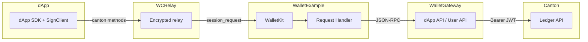
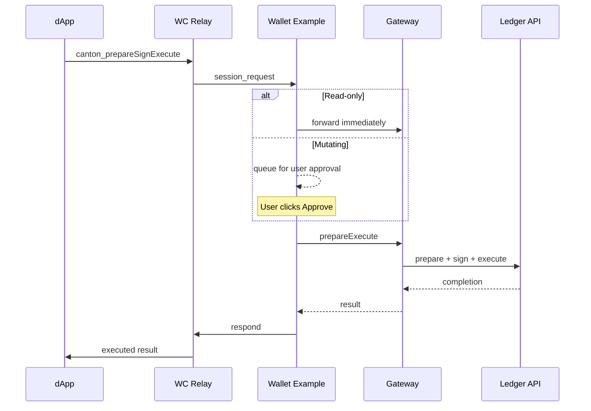

## Summary

Adds WalletConnect transport support to the dApp SDK, enabling dApps to connect to Canton wallets over the WalletConnect v2 relay. Includes a standalone wallet example app that acts as the WalletKit counterpart.

### Architecture

### Request flow

### WC protocol spec

| SDK method              | Wire method                 | Approval |
| ----------------------- | --------------------------- | -------- |
| `prepareExecute`        | `canton_prepareSignExecute` | Manual   |
| `prepareExecuteAndWait` | `canton_prepareSignExecute` | Manual   |
| `ledgerApi`             | `canton_ledgerApi`          | Auto     |
| `listAccounts`          | `canton_listAccounts`       | Auto     |
| `getPrimaryAccount`     | `canton_getPrimaryAccount`  | Auto     |
| `getActiveNetwork`      | `canton_getActiveNetwork`   | Auto     |
| `status`                | `canton_status`             | Auto     |
| `signMessage`           | `canton_signMessage`        | Manual   |

- `connect` / `disconnect` are handled locally and never sent over the relay
- Both `prepareExecute` and `prepareExecuteAndWait` collapse into `canton_prepareSignExecute` - the wallet does the full prepare-sign-execute cycle
- Events: `accountsChanged`, `statusChanged` via session_event; `session_delete` is a built-in WC event

## Changes

### sdk/dapp-sdk

- **WalletConnectAdapter** - single class implementing both `ProviderAdapter` and `Provider<DappRpcTypes>`. Calls `signClient.request()` directly with `canton_` prefix. No intermediate transport or RPC client layers.
- **DappSDK** - adds `walletConnectProjectId` option, `getWalletConnectSessions()` for session restore, auto-registers the WC adapter when a project ID is provided.
- **sdk-controller** - relaxed type from `DappAsyncProvider` to `Provider<DappAsyncRpcTypes>` so the WC adapter can reuse it.

### examples/wallet (new)

Standalone React app on port 8082 that acts as a WalletConnect wallet:

- WalletKit initialization and session management
- Auto-dispatch for read-only methods (status, ledgerApi, listAccounts, etc.)
- Manual approval UI for `canton_prepareSignExecute` and `canton_signMessage`
- Session proposals with network selection
- Full prepare + sign + execute flow via the gateway dApp and User APIs
- Dashboard with wallet info, active sessions, pairing input

### examples/ping

- Adds `walletConnectProjectId` to connect options
- Session restore via `getWalletConnectSessions()` on mount

### examples/portfolio

- **Fixed disconnect handling**: split the single mount effect into two effects (matching the ping example pattern) so `onStatusChanged` is registered after connection, not buried in a `.then()` chain that never executes on fresh loads
- Adds `walletConnectProjectId` to connect options
- Session restore via `getWalletConnectSessions()` on mount

### core/wallet-ui-components

- Wallet picker handles `wc-uri` postMessage to display the WC URI for copy/paste pairing

## Test plan

- [ ] Ping + WalletConnect: start Canton, Gateway, Wallet Example, Ping. Connect via WC, create Ping contract, verify transaction appears
- [ ] Portfolio + WalletConnect: connect via WC, verify holdings load, disconnect from wallet side, verify portfolio resets cleanly
- [ ] Session restore: connect via WC, refresh dApp page, verify session is restored without re-pairing
- [ ] Wallet-side disconnect: connect, disconnect from wallet example, verify dApp resets to disconnected state
- [ ] dApp-side disconnect: connect, disconnect from dApp settings, verify wallet example shows session removed
- [ ] Existing flows: verify HTTP gateway connection still works for both ping and portfolio
