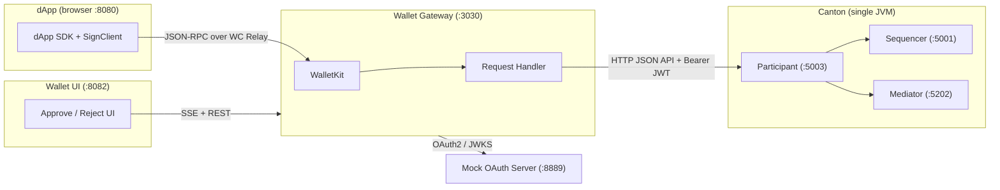
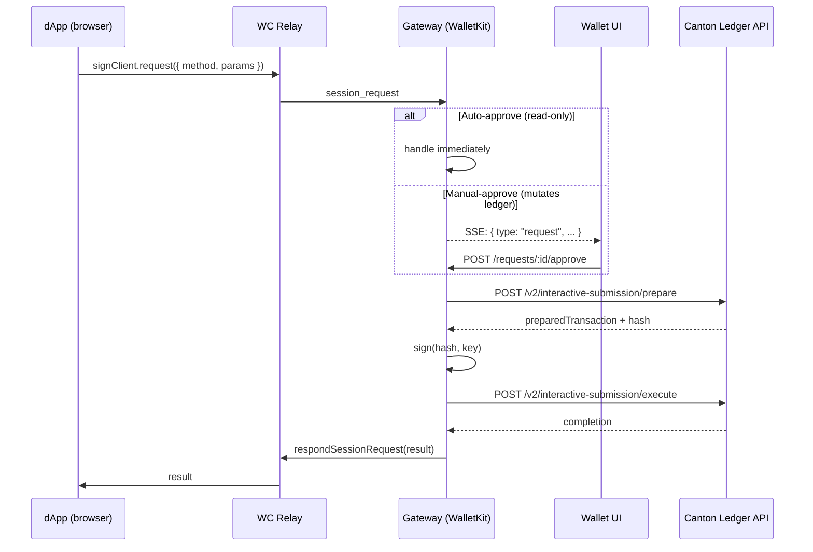
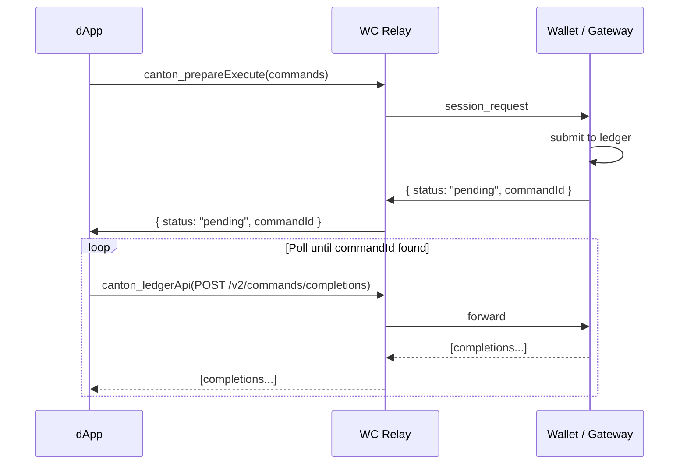
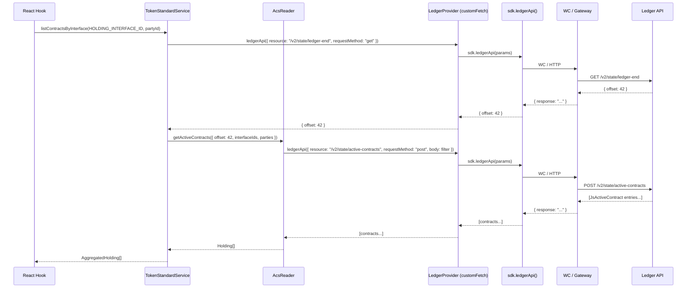

# WalletConnect Transport for Canton — Protocol Spec & Architecture

## Architecture



**Minimum services for a transaction: 4 processes**

| #   | Service                    | Port(s)          | Role                                                                       |
| --- | -------------------------- | ---------------- | -------------------------------------------------------------------------- |
| 1   | **Canton** (single JVM)    | 5001, 5003, 5012 | Sequencer + Mediator + Participant                                         |
| 2   | **Mock OAuth2 Server**     | 8889             | JWT issuance + JWKS for Ledger API auth                                    |
| 3   | **Wallet Gateway**         | 3030             | WalletKit host, tx preparation/signing, REST/SSE for wallet UI             |
| 4   | **dApp**                   | 8080             | Initiates WC session, sends commands                                       |
| 5   | **Wallet UI** _(optional)_ | 8082             | Manual approve/reject for proposals + `canton_prepareSignExecute` requests |

---

## End-to-End Request Flow



---

## Protocol Spec

### Namespace & Chain ID (CAIP-2)

- **Namespace**: `canton`
- **Chain ID**: `canton:<network-id>` (e.g. `canton:devnet`, `canton:mainnet`)
- **Account (CAIP-10)**: `canton:<network-id>:<url-encoded-party-id>`

### Registered Methods

```typescript
const CANTON_WC_METHODS = [
    'canton_prepareSignExecute',
    'canton_listAccounts',
    'canton_getPrimaryAccount',
    'canton_getActiveNetwork',
    'canton_status',
    'canton_ledgerApi',
    'canton_signMessage',
]
```

### Registered Events

```typescript
const CANTON_WC_EVENTS = ['accountsChanged', 'statusChanged']
```

### Method Name Mapping (dApp transport)

The `WalletConnectTransport` maps SDK method names before sending over WC:

```typescript
const METHOD_MAP = {
    prepareExecute: 'canton_prepareSignExecute',
    prepareExecuteAndWait: 'canton_prepareSignExecute',
    listAccounts: 'canton_listAccounts',
    getPrimaryAccount: 'canton_getPrimaryAccount',
    getActiveNetwork: 'canton_getActiveNetwork',
    status: 'canton_status',
    ledgerApi: 'canton_ledgerApi',
    signMessage: 'canton_signMessage',
}
```

All SDK method names are mapped to their `canton_`-prefixed WC wire equivalents.

**Current behavior**: Both `prepareExecute` (fire-and-forget) and `prepareExecuteAndWait` (synchronous) are collapsed into a single `canton_prepareSignExecute` WC method. The wallet always does the full prepare-sign-execute cycle and responds only when the transaction is complete. Every submission is effectively synchronous.

**Alternative: separate fire-and-forget `prepareExecute`**

The mapping could be changed so `canton_prepareExecute` and `canton_prepareSignExecute` are distinct WC methods:

| SDK method              | WC method                   | Wallet behavior                             | Response                                     |
| ----------------------- | --------------------------- | ------------------------------------------- | -------------------------------------------- |
| `prepareExecuteAndWait` | `canton_prepareSignExecute` | Prepare, sign, execute, wait for completion | `{ status: "executed", commandId, payload }` |
| `prepareExecute`        | `canton_prepareExecute`     | Prepare, sign, execute, return immediately  | `{ status: "pending", commandId }`           |

With this approach, the dApp can poll for completion itself using the existing `canton_ledgerApi` method:



This requires:

1. Removing the `METHOD_MAP` entries in `WalletConnectTransport`
2. Adding a `canton_prepareExecute` case in the gateway's `handleRequest()` that submits without waiting
3. Adding `canton_prepareExecute` to `CANTON_WC_METHODS`

Both `canton_prepareExecute` and `canton_prepareSignExecute` must remain **manual-approve** (not in `AUTO_APPROVE_METHODS`) since they mutate the ledger. Any request that changes ledger state should always require explicit user approval in the wallet UI.

### Auto-Approve vs Manual-Approve

```typescript
const AUTO_APPROVE_METHODS = new Set([
    'canton_listAccounts',
    'canton_getPrimaryAccount',
    'canton_getActiveNetwork',
    'canton_status',
    'canton_ledgerApi',
])
```

Auto-approved methods are **read-only** queries handled immediately by the gateway. All methods that mutate the ledger (`canton_prepareSignExecute`, `canton_prepareExecute`) or perform sensitive operations (`canton_signMessage`) are queued and require explicit user approval in the wallet UI before execution.

---

## Session Lifecycle

### 1. Pairing

**dApp creates pairing URI:**

```typescript
const { uri, approval } = await signClient.connect({
    requiredNamespaces: {
        canton: {
            chains: ['canton:devnet'],
            methods: CANTON_WC_METHODS,
            events: CANTON_WC_EVENTS,
        },
    },
})
```

**URI is delivered to gateway** via one of:

- `onUri` callback → user copies manually → wallet UI pastes into pairing input
- `pairUrl` config → dApp POSTs to gateway automatically

**Gateway pairs:**

```
POST /api/walletconnect/pair
Content-Type: application/json

{ "uri": "wc:abc123@2?relay-protocol=irn&symKey=xyz..." }
```

**Response:**

```json
{ "ok": true }
```

### 2. Session Proposal

After pairing, the WC relay delivers a `session_proposal` event to the gateway's WalletKit.

**Proposal structure (as queued in gateway):**

```typescript
interface PendingProposal {
    id: number // WC proposal ID
    proposal: WalletKitTypes.SessionProposal // full WC proposal object
    peerName: string // e.g. "Canton Portfolio"
    peerUrl: string // e.g. "http://localhost:8080"
    peerDescription: string
    methods: string[] // e.g. ["canton_prepareSignExecute", "canton_listAccounts", ...]
    events: string[] // e.g. ["accountsChanged", "statusChanged"]
    chains: string[] // e.g. ["canton:devnet"]
    receivedAt: string // ISO 8601 timestamp
}
```

**SSE event pushed to wallet UI:**

```
data: {"type":"proposal","proposal":{"id":1234,"peerName":"Canton Portfolio","peerUrl":"http://localhost:8080","peerDescription":"...","methods":[...],"events":[...],"chains":["canton:devnet"],"receivedAt":"2026-03-18T12:00:00.000Z"}}
```

### 3. Session Approval

**Wallet UI approves:**

```
POST /api/walletconnect/proposals/1234/approve
```

**Gateway builds approved namespaces:**

```typescript
{
    canton: {
        chains: ['canton:devnet'],
        accounts: ['canton:devnet:operator%3A%3A1220abc...'],   // CAIP-10 with URL-encoded partyId
        methods: ['canton_prepareSignExecute', 'canton_listAccounts', 'canton_getPrimaryAccount', 'canton_getActiveNetwork', 'canton_status', 'canton_ledgerApi', 'canton_signMessage'],
        events: ['accountsChanged', 'statusChanged'],
    }
}
```

**Response:**

```json
{ "ok": true, "topic": "session-topic-hex-string" }
```

**SSE event:**

```
data: {"type":"proposal_resolved","id":1234,"action":"approved"}
```

**dApp side**: the `approval()` promise resolves with the `SessionTypes.Struct`.

### 4. Session Rejection

```
POST /api/walletconnect/proposals/1234/reject
```

**Response:**

```json
{ "ok": true }
```

**WC error sent to dApp:**

```json
{ "code": 5000, "message": "User rejected" }
```

### 5. Session Disconnect

```
DELETE /api/walletconnect/sessions/<topic>
```

**WC disconnect reason:**

```json
{ "code": 6000, "message": "Wallet disconnected" }
```

**SSE event (when peer disconnects):**

```
data: {"type":"session_deleted","topic":"abc123..."}
```

---

## WC Methods — Full Request/Response Structures

Each method below shows:

1. What the **dApp sends** over WC (`signClient.request`)
2. What the **gateway handler receives** and does
3. What the **gateway responds** back over WC

### `canton_prepareSignExecute`

**WC request (dApp → relay → gateway):**

```json
{
    "topic": "<session-topic>",
    "chainId": "canton:devnet",
    "request": {
        "method": "canton_prepareSignExecute",
        "params": {
            "commands": {
                "0": {
                    "ExerciseCommand": {
                        "templateId": "#<package-id>:Module:Template",
                        "contractId": "00abcdef...",
                        "choice": "Transfer",
                        "choiceArgument": {
                            "receiver": "bob::1220..."
                        }
                    }
                }
            },
            "commandId": "d290f1ee-6c54-4b01-90e6-d701748f0851",
            "actAs": ["operator::1220abc..."],
            "readAs": [],
            "disclosedContracts": [
                {
                    "templateId": "#<package-id>:Module:Template",
                    "contractId": "00abcdef...",
                    "createdEventBlob": "<base64-encoded-blob>",
                    "synchronizerId": "wallet::1220e7b..."
                }
            ],
            "packageIdSelectionPreference": ["<package-id>"]
        }
    }
}
```

**Params TypeScript type:**

```typescript
interface PrepareParams {
    commandId?: string
    commands?: { [k: string]: unknown }
    actAs?: string[]
    readAs?: string[]
    disclosedContracts?: Array<{
        templateId?: string
        contractId?: string
        createdEventBlob: string
        synchronizerId?: string
    }>
    packageIdSelectionPreference?: string[]
}
```

**Gateway transforms to Ledger API request via `ledgerPrepareParams()`:**

```json
{
    "commands": { "0": { "ExerciseCommand": { ... } } },
    "commandId": "d290f1ee-...",
    "userId": "operator",
    "actAs": ["operator::1220abc..."],
    "readAs": [],
    "disclosedContracts": [
        {
            "templateId": "#<package-id>:Module:Template",
            "contractId": "00abcdef...",
            "createdEventBlob": "<base64>",
            "synchronizerId": "wallet::1220e7b..."
        }
    ],
    "synchronizerId": "wallet::1220e7b...",
    "verboseHashing": false,
    "packageIdSelectionPreference": ["<package-id>"]
}
```

**Signing flow depends on `wallet.signingProviderId`:**

| Provider        | Ledger API Endpoints                                                                                             | Flow                                      |
| --------------- | ---------------------------------------------------------------------------------------------------------------- | ----------------------------------------- |
| `participant`   | `POST /v2/commands/submit-and-wait`                                                                              | Single call, participant signs internally |
| `wallet-kernel` | `POST /v2/interactive-submission/prepare` → sign locally → `POST /v2/interactive-submission/execute`             | External signing with Ed25519             |
| `blockdaemon`   | `POST /v2/interactive-submission/prepare` → sign via Blockdaemon API → `POST /v2/interactive-submission/execute` | External signing via Blockdaemon          |

**Ledger API: Prepare request** (`POST /v2/interactive-submission/prepare`):

```json
{
    "commands": { ... },
    "commandId": "d290f1ee-...",
    "userId": "operator",
    "actAs": ["operator::1220abc..."],
    "readAs": [],
    "disclosedContracts": [ ... ],
    "synchronizerId": "wallet::1220e7b...",
    "verboseHashing": false,
    "packageIdSelectionPreference": []
}
```

**Ledger API: Prepare response:**

```json
{
    "preparedTransaction": "<base64-encoded-prepared-tx>",
    "preparedTransactionHash": "<hex-encoded-hash>"
}
```

**Ledger API: Execute request** (`POST /v2/interactive-submission/execute`):

```json
{
    "userId": "operator",
    "preparedTransaction": "<base64-encoded-prepared-tx>",
    "hashingSchemeVersion": "HASHING_SCHEME_VERSION_V2",
    "submissionId": "d290f1ee-...",
    "deduplicationPeriod": { "Empty": {} },
    "partySignatures": {
        "signatures": [
            {
                "party": "operator::1220abc...",
                "signatures": [
                    {
                        "signature": "<base64-ed25519-signature>",
                        "signedBy": "<namespace-fingerprint>",
                        "format": "SIGNATURE_FORMAT_CONCAT",
                        "signingAlgorithmSpec": "SIGNING_ALGORITHM_SPEC_ED25519"
                    }
                ]
            }
        ]
    }
}
```

**WC response (success):**

```json
{
    "id": 1234,
    "jsonrpc": "2.0",
    "result": {
        "status": "executed",
        "commandId": "d290f1ee-...",
        "payload": {
            "updateId": "tx-update-id",
            "completionOffset": 42
        }
    }
}
```

**WC response (error):**

```json
{
    "id": 1234,
    "jsonrpc": "2.0",
    "error": {
        "code": 5001,
        "message": "Transaction execution failed: INVALID_ARGUMENT: ..."
    }
}
```

**WC response (user rejected via wallet UI):**

```json
{
    "id": 1234,
    "jsonrpc": "2.0",
    "error": {
        "code": 5000,
        "message": "User rejected"
    }
}
```

---

### `canton_listAccounts`

**WC request:**

```json
{
    "topic": "<session-topic>",
    "chainId": "canton:devnet",
    "request": {
        "method": "canton_listAccounts",
        "params": {}
    }
}
```

**Handler:** `store.getWallets()` — returns all configured wallets.

**WC response:**

```json
{
    "id": 1235,
    "jsonrpc": "2.0",
    "result": [
        {
            "primary": true,
            "partyId": "operator::1220abc...",
            "status": "allocated",
            "hint": "operator",
            "publicKey": "<base64-ed25519-pubkey>",
            "namespace": "1220abc...",
            "networkId": "canton:local-oauth",
            "signingProviderId": "participant",
            "disabled": false
        }
    ]
}
```

**Wallet type:**

```typescript
interface Wallet {
    primary: boolean
    partyId: string
    status: 'initialized' | 'allocated' | 'removed'
    hint: string
    publicKey: string
    namespace: string
    networkId: string
    signingProviderId: string // 'participant' | 'wallet-kernel' | 'fireblocks' | 'blockdaemon'
    externalTxId?: string
    topologyTransactions?: string
    disabled?: boolean
    reason?: string
}
```

---

### `canton_getPrimaryAccount`

**WC request:**

```json
{
    "topic": "<session-topic>",
    "chainId": "canton:devnet",
    "request": {
        "method": "canton_getPrimaryAccount",
        "params": {}
    }
}
```

**Handler:** `store.getPrimaryWallet()` — returns the wallet where `primary === true`.

**WC response:**

```json
{
    "id": 1236,
    "jsonrpc": "2.0",
    "result": {
        "primary": true,
        "partyId": "operator::1220abc...",
        "status": "allocated",
        "hint": "operator",
        "publicKey": "<base64-ed25519-pubkey>",
        "namespace": "1220abc...",
        "networkId": "canton:local-oauth",
        "signingProviderId": "participant"
    }
}
```

---

### `canton_getActiveNetwork`

**WC request:**

```json
{
    "topic": "<session-topic>",
    "chainId": "canton:devnet",
    "request": {
        "method": "canton_getActiveNetwork",
        "params": {}
    }
}
```

**Handler:** `store.getCurrentNetwork()` — returns the active network config.

**WC response:**

```json
{
    "id": 1237,
    "jsonrpc": "2.0",
    "result": {
        "networkId": "canton:local-oauth",
        "ledgerApi": "http://127.0.0.1:5003"
    }
}
```

---

### `canton_status`

**WC request:**

```json
{
    "topic": "<session-topic>",
    "chainId": "canton:devnet",
    "request": {
        "method": "canton_status",
        "params": {}
    }
}
```

**Handler:** Checks ledger connectivity via `GET /v2/version`.

**WC response (ledger reachable):**

```json
{
    "id": 1238,
    "jsonrpc": "2.0",
    "result": {
        "provider": {
            "id": "remote-da",
            "version": "TODO",
            "providerType": "remote"
        },
        "connection": {
            "isConnected": true,
            "isNetworkConnected": true
        },
        "network": {
            "networkId": "canton:local-oauth",
            "ledgerApi": "http://127.0.0.1:5003"
        }
    }
}
```

**WC response (ledger unreachable):**

```json
{
    "id": 1238,
    "jsonrpc": "2.0",
    "result": {
        "provider": {
            "id": "remote-da",
            "version": "TODO",
            "providerType": "remote"
        },
        "connection": {
            "isConnected": true,
            "isNetworkConnected": false,
            "reason": "Ledger unreachable"
        }
    }
}
```

---

### `canton_ledgerApi`

Proxies raw Ledger API requests through the gateway. The gateway authenticates and forwards.

**WC request:**

```json
{
    "topic": "<session-topic>",
    "chainId": "canton:devnet",
    "request": {
        "method": "canton_ledgerApi",
        "params": {
            "requestMethod": "GET",
            "resource": "/v2/state/active-contracts",
            "body": "{\"filter\":{\"filtersByParty\":{\"operator::1220abc...\":{\"cumulative\":{\"templateFilters\":[]}}}}}"
        }
    }
}
```

**Params type:**

```typescript
interface LedgerApiParams {
    requestMethod: 'GET' | 'POST'
    resource: string
    body?: string | object
    path?: Record<string, string>
    query?: Record<string, string>
}
```

**Handler:** Routes to `LedgerClient.getWithRetry()` for GET or `LedgerClient.postWithRetry()` for POST. The gateway adds its own auth token to the Ledger API request. The `path` and `query` parameters are forwarded to the Ledger API client for URL parameter interpolation.

**WC response:**

```json
{
    "id": 1239,
    "jsonrpc": "2.0",
    "result": {
        "version": "3.4.0",
        "features": { ... }
    }
}
```

The result is the **raw Ledger API response** (not stringified). This matches the dapp controller's `ledgerApi` return shape, allowing `window.canton` to be used directly as a `LedgerProvider`.

---

### `canton_signMessage`

Declared in `CANTON_WC_METHODS` but **not implemented**. The handler throws:

```json
{
    "id": 1240,
    "jsonrpc": "2.0",
    "error": {
        "code": 5001,
        "message": "Unsupported WalletConnect method: canton_signMessage"
    }
}
```

---

## How the dApp Fetches Balances (End-to-End)

The dApp never has direct access to the Ledger API. All ledger queries are proxied through the connected provider (gateway via HTTP or WalletConnect). Here's the full chain for fetching token balances:



### Step 1: React hook calls `listHoldings()`

```typescript
const holdingsQuery = useQuery({
    queryKey: queryKeys.listHoldings.forParty(partyId),
    queryFn: () => listHoldings({ party: partyId }),
})
```

### Step 2: `listHoldings()` queries via `TokenStandardService`

```typescript
const utxoContracts =
    await tokenStandardService.listContractsByInterface<Holding>(
        HOLDING_INTERFACE_ID,
        party
    )
```

### Step 3: `TokenStandardService` makes two `canton_ledgerApi` calls

**First call — get current ledger offset:**

```json
{
    "method": "canton_ledgerApi",
    "params": {
        "resource": "/v2/state/ledger-end",
        "requestMethod": "get"
    }
}
```

Response: `{ "offset": 42 }`

**Second call — query active contracts with interface filter:**

```json
{
    "method": "canton_ledgerApi",
    "params": {
        "resource": "/v2/state/active-contracts",
        "requestMethod": "post",
        "body": {
            "filter": {
                "filtersByParty": {
                    "operator::1220abc...": {
                        "cumulative": [
                            {
                                "identifierFilter": {
                                    "InterfaceFilter": {
                                        "value": {
                                            "interfaceId": "<HOLDING_INTERFACE_ID>",
                                            "includeCreatedEventBlob": true,
                                            "includeInterfaceView": true
                                        }
                                    }
                                }
                            }
                        ]
                    }
                }
            },
            "verbose": false,
            "activeAtOffset": 42
        }
    }
}
```

### Step 4: The `LedgerProvider` proxy

The dApp uses `window.canton` (the injected dApp provider) directly as a `LedgerProvider`. When the SDK is connected via WalletConnect, `window.canton.request({ method: 'ledgerApi', params })` is handled by the `WalletConnectDappProvider`, which delegates to `DappSyncProvider(WalletConnectTransport)`:

```typescript
const resolveLedgerProvider = () => {
    if (window.canton) {
        return window.canton as unknown as LedgerProvider
    } else {
        throw new Error('window.canton is not available')
    }
}
```

`TokenStandardService` calls `provider.request({ method: 'ledgerApi', params: { resource, requestMethod, body } })` and receives the **raw ledger response** directly — no unwrapping needed.

### Step 5: Over the wire

Each `provider.request({ method: 'ledgerApi', ... })` call is mapped to `canton_ledgerApi` by the `WalletConnectTransport`. Over WalletConnect, that's:

```json
{
    "topic": "<session-topic>",
    "chainId": "canton:devnet",
    "request": {
        "method": "canton_ledgerApi",
        "params": {
            "requestMethod": "POST",
            "resource": "/v2/state/active-contracts",
            "body": { "filter": { "filtersByParty": { ... } }, "verbose": false, "activeAtOffset": 42 }
        }
    }
}
```

The gateway's `handleLedgerApi()` authenticates with the OAuth server, forwards to `http://127.0.0.1:5003/v2/state/active-contracts`, and returns the **raw ledger response**:

```json
{
    "id": 1239,
    "jsonrpc": "2.0",
    "result": [
        { "contractEntry": { "JsActiveContract": { "createdEvent": { ... }, "synchronizerId": "..." } } }
    ]
}
```

### Step 6: Parsing

The `AcsReader` filters responses to keep only `JsActiveContract` entries. `TokenStandardService` extracts `interfaceViewValue` from each created event to produce `Holding` objects:

```typescript
interface Holding {
    contractId: string
    owner: string
    instrument: { admin: string; id: string }
    amount: string
    lock?: { expiresAt?: string }
}
```

These are then aggregated by instrument into `AggregatedHolding[]` (summing amounts across UTXOs of the same instrument) and enriched with instrument metadata (name, symbol) from the registry.

---

## WC Events (Gateway → dApp)

Events are emitted via `walletkit.emitSessionEvent()`. Currently **not implemented** in the gateway handler — the events are only emitted internally via the notification service to the wallet UI. The dApp-side adapter listens for them:

```typescript
signClient.on('session_event', (event) => {
    const { name, data } = event.params.event
    this.emit(name, data)
})
```

### `accountsChanged`

**Payload structure (if emitted):**

```json
{
    "name": "accountsChanged",
    "data": [
        {
            "primary": true,
            "partyId": "operator::1220abc...",
            "status": "allocated",
            "hint": "operator",
            "publicKey": "...",
            "namespace": "1220abc...",
            "networkId": "canton:local-oauth",
            "signingProviderId": "participant"
        }
    ]
}
```

### `statusChanged`

**Payload structure (if emitted):**

```json
{
    "name": "statusChanged",
    "data": {
        "provider": { "id": "remote-da", "providerType": "remote" },
        "connection": { "isConnected": true, "isNetworkConnected": true },
        "network": { "networkId": "canton:local-oauth" }
    }
}
```

### `session_delete` (built-in WC event)

Handled by the dApp adapter:

```typescript
signClient.on('session_delete', () => {
    this.session = null
    this.inner = null
    this.emit('statusChanged', {
        provider: { id: 'walletconnect', providerType: 'mobile' },
        connection: {
            isConnected: false,
            isNetworkConnected: false,
            reason: 'Session deleted by wallet',
        },
    })
})
```

---

## SSE Events (Gateway → Wallet UI)

**Endpoint:** `GET /api/walletconnect/events`

The gateway pushes real-time events to the wallet UI app as Server-Sent Events.

| Event Type          | Payload                                                                                      | Trigger                                 |
| ------------------- | -------------------------------------------------------------------------------------------- | --------------------------------------- |
| `connected`         | `{"type":"connected"}`                                                                       | SSE connection established              |
| `proposal`          | `{"type":"proposal","proposal":<PendingProposal>}`                                           | New WC session proposal received        |
| `request`           | `{"type":"request","request":<PendingRequest>}`                                              | New WC session request needing approval |
| `session_deleted`   | `{"type":"session_deleted","topic":"..."}`                                                   | WC session disconnected                 |
| `proposal_resolved` | `{"type":"proposal_resolved","id":N,"action":"approved"\|"rejected"}`                        | Proposal was approved or rejected       |
| `request_resolved`  | `{"type":"request_resolved","id":N,"action":"approved"\|"rejected"\|"error","error?":"..."}` | Request was handled                     |

**PendingProposal SSE shape:**

```json
{
    "type": "proposal",
    "proposal": {
        "id": 1234,
        "peerName": "Canton Portfolio",
        "peerUrl": "http://localhost:8080",
        "peerDescription": "Canton Network dApp using WalletConnect",
        "methods": [
            "canton_prepareSignExecute",
            "canton_listAccounts",
            "canton_getPrimaryAccount",
            "canton_getActiveNetwork",
            "canton_status",
            "canton_ledgerApi",
            "canton_signMessage"
        ],
        "events": ["accountsChanged", "statusChanged"],
        "chains": ["canton:devnet"],
        "receivedAt": "2026-03-18T12:00:00.000Z"
    }
}
```

**PendingRequest SSE shape:**

```json
{
    "type": "request",
    "request": {
        "id": 5678,
        "topic": "session-topic-hex",
        "method": "canton_prepareSignExecute",
        "params": { "commands": { ... }, "actAs": [...], ... },
        "peerName": "Canton Portfolio",
        "receivedAt": "2026-03-18T12:01:00.000Z"
    }
}
```

---

## REST API (Wallet UI → Gateway)

**Base path:** `{GATEWAY_URL}/api/walletconnect`

### Pairing

| Method | Path    | Request Body          | Response         |
| ------ | ------- | --------------------- | ---------------- |
| `POST` | `/pair` | `{ "uri": "wc:..." }` | `{ "ok": true }` |

### Sessions

| Method   | Path               | Request Body | Response                                                                          |
| -------- | ------------------ | ------------ | --------------------------------------------------------------------------------- |
| `GET`    | `/sessions`        | —            | `[{ "topic": "...", "peerName": "...", "peerUrl": "...", "expiry": 1234567890 }]` |
| `DELETE` | `/sessions/:topic` | —            | `{ "ok": true }`                                                                  |

### Proposals

| Method | Path                     | Request Body | Response                                                                                                                                                |
| ------ | ------------------------ | ------------ | ------------------------------------------------------------------------------------------------------------------------------------------------------- |
| `GET`  | `/proposals`             | —            | `[{ "id": N, "peerName": "...", "peerUrl": "...", "peerDescription": "...", "methods": [...], "events": [...], "chains": [...], "receivedAt": "..." }]` |
| `POST` | `/proposals/:id/approve` | —            | `{ "ok": true, "topic": "session-topic" }`                                                                                                              |
| `POST` | `/proposals/:id/reject`  | —            | `{ "ok": true }`                                                                                                                                        |

### Requests

| Method | Path                    | Request Body | Response                                                                                                  |
| ------ | ----------------------- | ------------ | --------------------------------------------------------------------------------------------------------- |
| `GET`  | `/requests`             | —            | `[{ "id": N, "topic": "...", "method": "...", "params": {...}, "peerName": "...", "receivedAt": "..." }]` |
| `POST` | `/requests/:id/approve` | —            | `{ "ok": true, "result": { "status": "executed", ... } }`                                                 |
| `POST` | `/requests/:id/reject`  | —            | `{ "ok": true }`                                                                                          |

### Wallet & Status

| Method | Path                 | Request Body | Response                                                                                                             |
| ------ | -------------------- | ------------ | -------------------------------------------------------------------------------------------------------------------- |
| `GET`  | `/wallets`           | —            | `Wallet[]` (same schema as `canton_listAccounts`)                                                                    |
| `GET`  | `/status`            | —            | `{ "gatewayVersion": "...", "networkId": "...", "ledgerApi": "...", "ledgerVersion": "3.4.0", "isConnected": true }` |
| `GET`  | `/balances/:partyId` | —            | Raw Ledger API response from `POST /v2/state/active-contracts`                                                       |

---

## Error Codes

| Code   | Meaning                                | Used in                                       |
| ------ | -------------------------------------- | --------------------------------------------- |
| `5000` | User rejected                          | `rejectProposal`, `rejectRequest`             |
| `5001` | Execution/handler error                | any failed `handleRequest`                    |
| `5100` | Canton namespace not found in proposal | `session_proposal` without `canton` namespace |
| `6000` | Wallet disconnected                    | `disconnectSession`                           |

---

## dApp-Side Components

| Component                   | Location                                            | Role                                                               |
| --------------------------- | --------------------------------------------------- | ------------------------------------------------------------------ |
| `WalletConnectTransport`    | `core/rpc-transport/src/walletconnect-transport.ts` | Maps SDK methods → WC methods, sends via `SignClient`              |
| `WalletConnectAdapter`      | `sdk/dapp-sdk/src/adapter/walletconnect-adapter.ts` | `ProviderAdapter` that creates `WalletConnectDappProvider`         |
| `WalletConnectDappProvider` | (same file, private class)                          | Manages `SignClient` lifecycle, session connect/restore/disconnect |
| `DappSDK.connectTo()`       | `sdk/dapp-sdk/src/sdk.ts`                           | Connects directly to a named adapter (bypasses wallet picker)      |

## Gateway-Side Components

| Component                       | Location                                                           | Role                                                                 |
| ------------------------------- | ------------------------------------------------------------------ | -------------------------------------------------------------------- |
| `startWalletConnect()`          | `wallet-gateway/remote/src/walletconnect/walletconnect-handler.ts` | Initializes WalletKit, returns `WalletConnectController`             |
| `WalletConnectController`       | (same file)                                                        | Exposes pending queues, approve/reject methods, active sessions      |
| `handleRequest()`               | (same file)                                                        | Routes WC methods to handler functions                               |
| `registerWalletConnectRoutes()` | `wallet-gateway/remote/src/init.ts`                                | Registers all REST + SSE endpoints on Express app                    |
| `ledgerPrepareParams()`         | `wallet-gateway/remote/src/utils.ts`                               | Transforms `PrepareParams` → Ledger API `JsPrepareSubmissionRequest` |
